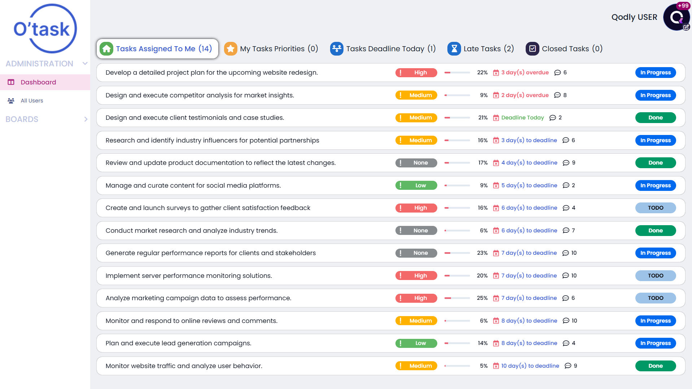
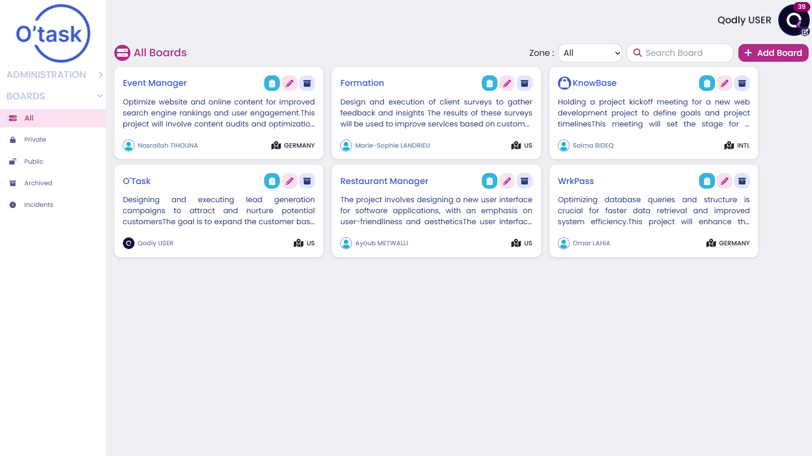
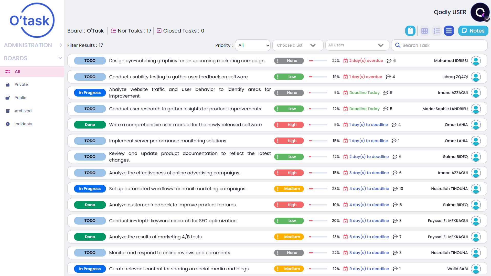
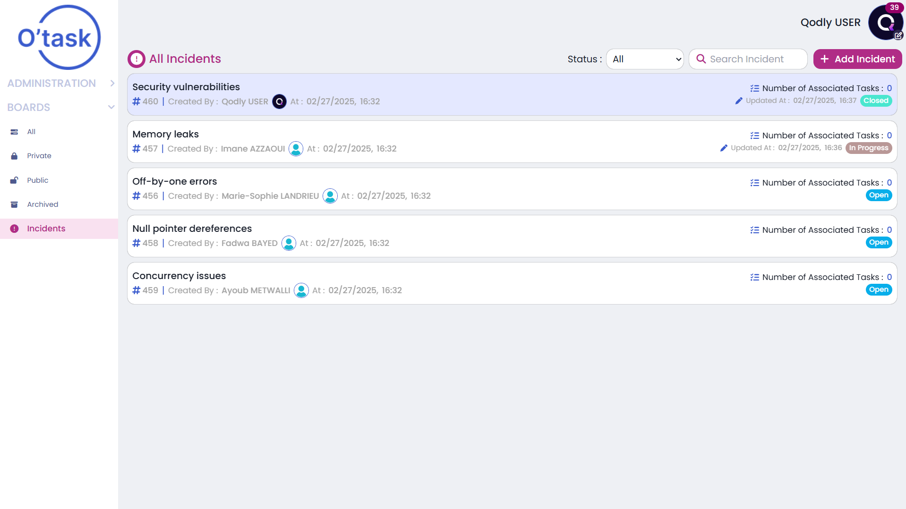
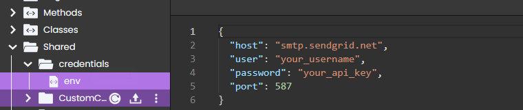

# ✅ OTask Application

This demo app is built with **4D Qodly Pro** and is designed to help teams manage projects, tasks, and incidents in a clear and structured way.

## Purpose of the application

The **OTask Application** centralizes project and task management into a single, intuitive system.  
It helps teams collaborate better by organizing work into boards, tracking tasks, and handling incidents separately.

The application aims to:

- Structure work into **boards (projects)**  
- Track **tasks** and their progress  
- Manage **incidents** independently from tasks  
- Improve team visibility and collaboration  

---

## Main Features

- **Dashboard**: Global overview of boards, tasks, and incidents.  

  

- **Boards (Projects)**: Organize work into project-based boards.  

  

- **Task Management**: Create, assign, and track tasks with clear statuses.  

  

- **Incident Management**: Log, monitor, and resolve incidents efficiently.  

  

- **Role-Based Access**: Access and visibility adapted to user roles.

## How to Run

### Pre-requisites (4D Software)
- Download the 4D version 21 LTS or later (the minimum required version 4D 21 LTS): [Product Download](https://us.4d.com/product-download/4D-21-LTS)  
- Or the latest Beta version: [Beta Program](https://discuss.4d.com/)  
- Follow activation steps: [Installation Guide](https://developer.4d.com/docs/GettingStarted/installation)

### Steps to Run the Project
- Clone or download this repository to your local machine.  
- Open the project in 4D: **File > Open Project**  
- Open **Qodly Studio**: **Design > Qodly Studio**  
- Click **Run** to start the server and preview the app in your browser.

---

## Configuration & Credentials

### Do I need to create external accounts?
- **Mailing (optional)**: Required only if you want email notifications (task or incident reminders).
  - SMTP-compatible services such as **SendGrid SMTP** can be used.

### Where does the app read credentials?
- Mailing credentials are loaded from an `env.json` file located in the **credentials** folder.
- This file contains SMTP configuration such as host, port, user, and password.

Example format:

### Security Best Practices
- Do not commit real credentials to source control.
- Add `env.json` to `.gitignore`.
---

## Test Accounts and Sample Data

- Sample data can be generated via a dedicated data generator function or from the UI.
- To test the login, you can use the following credentials:
  - **Email:** ava.robinson@4d.com  
  - **Password:** 123456

---

## Where to Find the Code for Each Feature

- **Generating data**

  - Server: `InitData.4dm` — Generated random data for the application's dataclasses.

  - UI: `HomePage.WebForm`

- **Authentication & Roles**
  - Server: `DataStore.4dm`
  - UI: `SignIn.WebForm` / `HomePage.WebForm`

- **Custom UI components** used to enhance user experience, including:

  - Tags (in the editTask page and other pages)

  - Slate editor (in the updateIncident page and other pages)

This structure allows you to easily customize, extend, or reuse **OTask** as a foundation for your own project, task, and incident management solutions.
